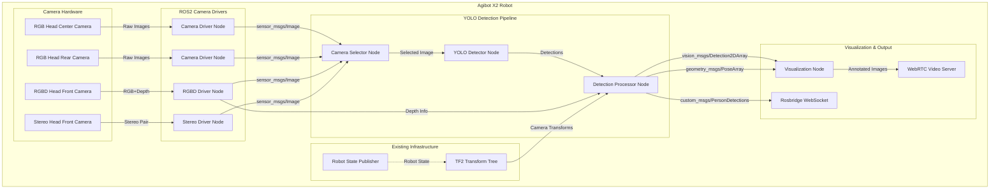
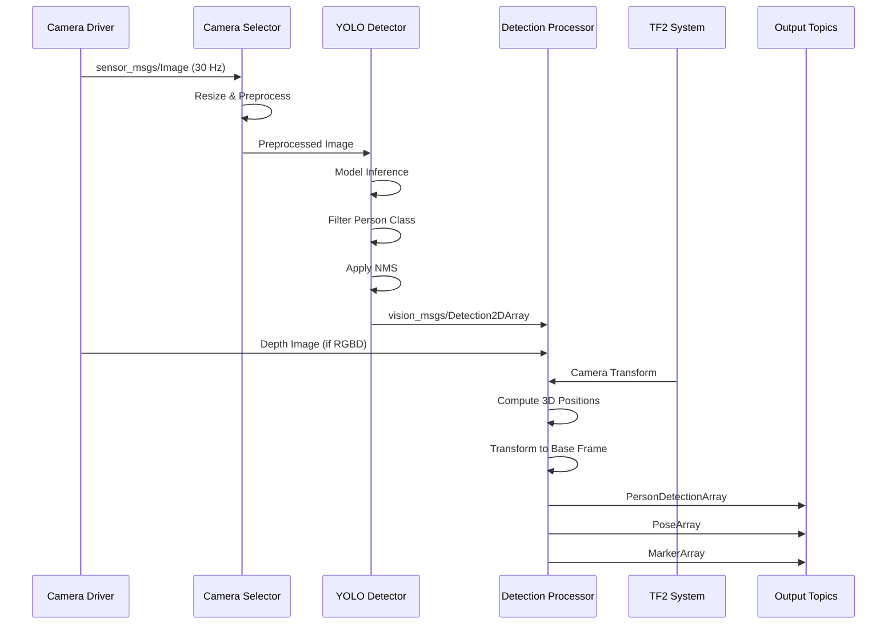
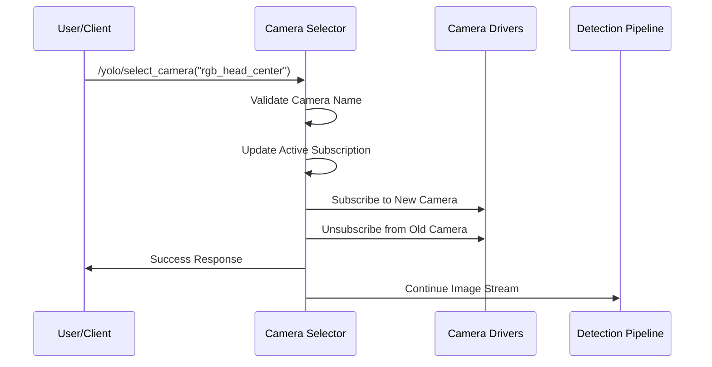

# Design Document: YOLO Person Detector Pipeline

## Overview

This design specifies a real-time YOLO-based person detection pipeline for the Agibot X2 humanoid robot running ROS2 Humble. The system captures video streams from the robot's onboard cameras, processes frames through a YOLO object detection model to identify persons, and publishes detection results (bounding boxes, confidence scores, 3D positions) to ROS2 topics. The pipeline integrates seamlessly with the existing ROS2 infrastructure including robot state publisher, rosbridge WebSocket server, and WebRTC video streaming.

The design prioritizes real-time performance suitable for humanoid robot control applications, leveraging GPU acceleration when available, and provides visualization capabilities for debugging and monitoring.

## Architecture

The system follows a modular ROS2 node architecture with clear separation of concerns:



## System Components

### 1. Camera Selector Node

**Purpose**: Manages camera source selection and provides unified image stream output

**Responsibilities**:
- Subscribe to all available camera topics
- Provide dynamic camera selection via ROS2 parameter or service
- Handle camera switching without pipeline restart
- Perform basic image preprocessing (resize, format conversion)
- Publish selected camera stream to detection pipeline

**ROS2 Interface**:
```python
# Subscribed Topics
/camera/rgb_head_center/image_raw          # sensor_msgs/Image
/camera/rgb_head_rear/image_raw            # sensor_msgs/Image
/camera/rgbd_head_front/color/image_raw    # sensor_msgs/Image
/camera/stereo_head_front/left/image_raw   # sensor_msgs/Image

# Published Topics
/yolo/input_image                          # sensor_msgs/Image
/yolo/camera_info                          # sensor_msgs/CameraInfo

# Parameters
active_camera: "rgb_head_center"           # string
target_fps: 30                             # int
resize_width: 640                          # int
resize_height: 480                         # int

# Services
/yolo/select_camera                        # std_srvs/SetString
```

### 2. YOLO Detector Node

**Purpose**: Core detection engine that processes images through YOLO model

**Responsibilities**:
- Load and initialize YOLO model (YOLOv8/YOLOv10)
- Process incoming image frames
- Filter detections for "person" class only
- Apply confidence threshold filtering
- Perform Non-Maximum Suppression (NMS)
- Publish raw detection results with bounding boxes

**ROS2 Interface**:
```python
# Subscribed Topics
/yolo/input_image                          # sensor_msgs/Image

# Published Topics
/yolo/detections                           # vision_msgs/Detection2DArray
/yolo/detection_image                      # sensor_msgs/Image (annotated)
/yolo/inference_time                       # std_msgs/Float32

# Parameters
model_path: "yolov8n.pt"                   # string
confidence_threshold: 0.5                  # float
nms_threshold: 0.45                        # float
device: "cuda"                             # string (cuda/cpu)
input_size: [640, 640]                     # list[int]
person_class_id: 0                         # int

# Services
/yolo/reload_model                         # std_srvs/Trigger
```

**Model Selection Strategy**:
- **YOLOv8n** (nano): Fastest, suitable for CPU inference, ~3ms on GPU
- **YOLOv8s** (small): Balanced speed/accuracy, ~5ms on GPU
- **YOLOv8m** (medium): Higher accuracy, ~10ms on GPU
- **YOLOv10**: Latest architecture with improved efficiency

Default: YOLOv8n for real-time performance on humanoid robot

### 3. Detection Processor Node

**Purpose**: Enriches detections with 3D spatial information and transforms

**Responsibilities**:
- Convert 2D bounding boxes to 3D positions using depth data
- Transform detections from camera frame to robot base frame
- Calculate person distance and bearing from robot
- Track person IDs across frames (optional)
- Publish enriched detection messages

**ROS2 Interface**:
```python
# Subscribed Topics
/yolo/detections                           # vision_msgs/Detection2DArray
/camera/rgbd_head_front/depth/image_raw    # sensor_msgs/Image
/tf                                        # tf2_msgs/TFMessage

# Published Topics
/yolo/person_detections                    # custom_msgs/PersonDetectionArray
/yolo/person_poses                         # geometry_msgs/PoseArray
/yolo/person_markers                       # visualization_msgs/MarkerArray

# Parameters
use_depth: true                            # bool
max_detection_distance: 10.0               # float (meters)
min_detection_distance: 0.3                # float (meters)
target_frame: "base_link"                  # string
enable_tracking: false                     # bool
```

### 4. Visualization Node

**Purpose**: Provides visual feedback for debugging and monitoring

**Responsibilities**:
- Overlay bounding boxes on camera images
- Display confidence scores and person IDs
- Render 3D markers in RViz
- Publish annotated images for WebRTC streaming
- Generate diagnostic information

**ROS2 Interface**:
```python
# Subscribed Topics
/yolo/input_image                          # sensor_msgs/Image
/yolo/person_detections                    # custom_msgs/PersonDetectionArray

# Published Topics
/yolo/visualization_image                  # sensor_msgs/Image
/yolo/debug_markers                        # visualization_msgs/MarkerArray

# Parameters
show_confidence: true                      # bool
show_distance: true                        # bool
bbox_color: [0, 255, 0]                    # list[int] (RGB)
bbox_thickness: 2                          # int
font_scale: 0.5                            # float
```

## Data Models

### PersonDetection Message

Custom ROS2 message type for enriched person detections:

```python
# custom_msgs/PersonDetection.msg

std_msgs/Header header

# 2D Detection Information
vision_msgs/Detection2D detection_2d
float32 confidence
int32 person_id

# 3D Spatial Information
geometry_msgs/Point position_camera_frame
geometry_msgs/Point position_base_frame
float32 distance
float32 bearing_angle

# Bounding Box in Image Space
int32 bbox_x
int32 bbox_y
int32 bbox_width
int32 bbox_height

# Metadata
string camera_source
builtin_interfaces/Time detection_timestamp
```

### PersonDetectionArray Message

```python
# custom_msgs/PersonDetectionArray.msg

std_msgs/Header header
custom_msgs/PersonDetection[] detections
int32 num_persons
float32 inference_time_ms
```

## Data Flow

### Main Processing Pipeline



### Camera Selection Flow



## ROS2 Topic Structure

### Topic Hierarchy

```
/camera/
├── rgb_head_center/
│   ├── image_raw                    (sensor_msgs/Image)
│   └── camera_info                  (sensor_msgs/CameraInfo)
├── rgb_head_rear/
│   ├── image_raw                    (sensor_msgs/Image)
│   └── camera_info                  (sensor_msgs/CameraInfo)
├── rgbd_head_front/
│   ├── color/
│   │   ├── image_raw                (sensor_msgs/Image)
│   │   └── camera_info              (sensor_msgs/CameraInfo)
│   └── depth/
│       ├── image_raw                (sensor_msgs/Image)
│       └── camera_info              (sensor_msgs/CameraInfo)
└── stereo_head_front/
    ├── left/
    │   ├── image_raw                (sensor_msgs/Image)
    │   └── camera_info              (sensor_msgs/CameraInfo)
    └── right/
        ├── image_raw                (sensor_msgs/Image)
        └── camera_info              (sensor_msgs/CameraInfo)

/yolo/
├── input_image                      (sensor_msgs/Image)
├── camera_info                      (sensor_msgs/CameraInfo)
├── detections                       (vision_msgs/Detection2DArray)
├── detection_image                  (sensor_msgs/Image)
├── person_detections                (custom_msgs/PersonDetectionArray)
├── person_poses                     (geometry_msgs/PoseArray)
├── person_markers                   (visualization_msgs/MarkerArray)
├── visualization_image              (sensor_msgs/Image)
├── debug_markers                    (visualization_msgs/MarkerArray)
└── inference_time                   (std_msgs/Float32)
```

### Message Flow Rates

| Topic | Rate | QoS Profile |
|-------|------|-------------|
| Camera image streams | 30 Hz | SENSOR_DATA (best effort) |
| YOLO detections | 30 Hz | RELIABLE |
| Person poses | 30 Hz | RELIABLE |
| Visualization images | 10 Hz | SENSOR_DATA |
| Inference time | 1 Hz | RELIABLE |

## Camera Integration Strategy

### Camera Selection Criteria

**Primary Camera: RGB Head Center**
- Forward-facing, centered field of view
- Best for person detection in front of robot
- No depth information (2D detections only)

**Secondary Camera: RGBD Head Front**
- Provides RGB + depth data
- Enables 3D position estimation
- Slightly offset from center
- Preferred when 3D localization is required

**Tertiary Cameras**:
- **RGB Head Rear**: For backward-facing detection
- **Stereo Head Front**: For stereo vision applications (future)

### Camera Calibration

Camera intrinsic parameters are obtained from:
```python
# From sensor_msgs/CameraInfo
K = [fx,  0, cx,
      0, fy, cy,
      0,  0,  1]

# Distortion coefficients
D = [k1, k2, p1, p2, k3]
```

Camera extrinsic transforms are obtained from TF2 tree:
```
base_link -> torso_link -> head_yaw_link -> head_pitch_link -> camera_link
```

### Depth Integration

When using RGBD camera:

1. **Depth Lookup**: For each detected bounding box center (u, v), lookup depth value d
2. **3D Projection**: Convert to 3D point in camera frame:
   ```
   X = (u - cx) * d / fx
   Y = (v - cy) * d / fy
   Z = d
   ```
3. **Transform**: Use TF2 to transform from camera frame to base_link frame
4. **Validation**: Filter detections outside valid depth range (0.3m - 10m)

## Correctness Properties

### Detection Accuracy Properties

**Property 1: Person Class Filtering**
- ∀ detection ∈ output_detections: detection.class_id = PERSON_CLASS_ID
- All published detections must be of class "person" only

**Property 2: Confidence Threshold**
- ∀ detection ∈ output_detections: detection.confidence ≥ confidence_threshold
- No low-confidence detections are published

**Property 3: Bounding Box Validity**
- ∀ detection ∈ output_detections:
  - 0 ≤ detection.bbox_x < image_width
  - 0 ≤ detection.bbox_y < image_height
  - detection.bbox_width > 0
  - detection.bbox_height > 0
  - detection.bbox_x + detection.bbox_width ≤ image_width
  - detection.bbox_y + detection.bbox_height ≤ image_height

### Spatial Properties

**Property 4: Depth Range Validation**
- ∀ detection ∈ output_detections WITH depth:
  - min_detection_distance ≤ detection.distance ≤ max_detection_distance
- Detections outside valid depth range are filtered

**Property 5: Transform Consistency**
- ∀ detection ∈ output_detections:
  - detection.position_base_frame = TF(detection.position_camera_frame, camera_frame → base_link)
- 3D positions are correctly transformed to robot base frame

### Performance Properties

**Property 6: Real-Time Processing**
- inference_time_ms ≤ 33.3ms (for 30 Hz operation)
- System maintains target frame rate under normal conditions

**Property 7: Message Synchronization**
- ∀ detection_msg: detection_msg.header.stamp ≈ input_image.header.stamp (within 10ms)
- Detection timestamps match input image timestamps

### Robustness Properties

**Property 8: Camera Failure Handling**
- IF camera_stream_timeout > 1.0s THEN publish diagnostic warning
- System gracefully handles camera disconnection

**Property 9: Model Loading**
- IF model_load_fails THEN node_state = ERROR AND publish diagnostic error
- System validates model file exists and is loadable at startup

## Error Handling

### Error Scenario 1: Camera Stream Timeout

**Condition**: No images received from selected camera for > 1 second

**Response**:
- Publish diagnostic warning message
- Attempt to reconnect to camera topic
- If reconnection fails after 5 attempts, switch to fallback camera

**Recovery**:
- Resume normal operation when camera stream restored
- Log camera downtime duration

### Error Scenario 2: Model Inference Failure

**Condition**: YOLO model inference raises exception

**Response**:
- Log error with stack trace
- Skip current frame
- Increment error counter
- If error_count > 10 consecutive frames, restart node

**Recovery**:
- Reset error counter on successful inference
- Continue processing next frame

### Error Scenario 3: Invalid Depth Data

**Condition**: Depth value is NaN, Inf, or outside valid range

**Response**:
- Publish 2D detection without 3D position
- Set detection.distance = -1.0 (invalid marker)
- Log warning (rate-limited to 1 Hz)

**Recovery**:
- Continue processing with 2D-only detections
- Attempt depth lookup on next frame

### Error Scenario 4: TF Transform Unavailable

**Condition**: Transform from camera frame to base_link not available

**Response**:
- Buffer detections for up to 100ms waiting for transform
- If transform still unavailable, publish detection in camera frame only
- Set detection.position_base_frame to (0, 0, 0) with validity flag = false

**Recovery**:
- Resume normal transform operation when TF becomes available
- Log TF timeout events

### Error Scenario 5: GPU Out of Memory

**Condition**: CUDA out of memory error during inference

**Response**:
- Fallback to CPU inference mode
- Reduce batch size to 1
- Publish diagnostic error message

**Recovery**:
- Attempt to reload model on GPU after 30 seconds
- If GPU still unavailable, continue with CPU inference

## Testing Strategy

### Unit Testing Approach

**Component Tests**:
- Camera Selector: Test camera switching, image preprocessing, parameter updates
- YOLO Detector: Test model loading, inference, confidence filtering, NMS
- Detection Processor: Test 3D projection, coordinate transforms, distance calculation
- Visualization: Test image annotation, marker generation

**Test Coverage Goals**:
- Code coverage: > 80%
- Branch coverage: > 70%
- Critical paths: 100%

**Key Test Cases**:
1. Model loads successfully with valid path
2. Model fails gracefully with invalid path
3. Detections filtered by confidence threshold
4. Bounding boxes clipped to image boundaries
5. Depth values correctly projected to 3D
6. TF transforms applied correctly
7. Camera switching works without frame drops

### Property-Based Testing Approach

**Property Test Library**: hypothesis (Python)

**Property Tests**:

1. **Bounding Box Invariants**:
   - Generate random bounding boxes
   - Verify all output boxes satisfy validity constraints
   - Test with various image sizes

2. **Confidence Filtering**:
   - Generate detections with random confidence values
   - Verify all output detections meet threshold
   - Test threshold boundary conditions

3. **3D Projection Consistency**:
   - Generate random pixel coordinates and depth values
   - Verify projected 3D points satisfy geometric constraints
   - Test inverse projection (3D → 2D → 3D) consistency

4. **Transform Composition**:
   - Generate random transforms
   - Verify transform chain consistency
   - Test inverse transforms

### Integration Testing Approach

**System-Level Tests**:
1. End-to-end pipeline test with recorded bag files
2. Multi-camera switching test
3. Performance test under load (multiple persons)
4. Stress test with rapid camera switching
5. Long-duration stability test (1 hour continuous operation)

**Test Environment**:
- ROS2 Humble on Ubuntu 22.04
- Simulated camera topics using rosbag replay
- Mock TF tree for robot transforms
- GPU and CPU inference modes

**Success Criteria**:
- Pipeline processes 30 fps without frame drops
- Detection latency < 50ms (camera to output)
- No memory leaks over 1 hour operation
- Graceful degradation under error conditions

## Performance Considerations

### Inference Optimization

**Model Optimization**:
- Use TensorRT for GPU acceleration (3-5x speedup)
- Quantize model to FP16 or INT8 for edge deployment
- Batch processing if multiple cameras active

**Pipeline Optimization**:
- Asynchronous image preprocessing
- Zero-copy image transfer where possible
- Efficient memory management (reuse buffers)

**Target Performance**:
- YOLOv8n on GPU: ~3-5ms inference
- YOLOv8n on CPU: ~30-50ms inference
- Total pipeline latency: < 50ms (camera to output)

### Resource Management

**Memory**:
- Model size: ~6 MB (YOLOv8n)
- Image buffers: ~3 MB per frame (640x480 RGB)
- Detection buffers: ~1 KB per detection
- Total estimated: ~50 MB

**CPU Usage**:
- Camera selector: ~5% (1 core)
- YOLO detector (CPU mode): ~80% (1 core)
- Detection processor: ~10% (1 core)
- Visualization: ~5% (1 core)

**GPU Usage**:
- YOLO detector (GPU mode): ~20% GPU utilization
- VRAM: ~500 MB

### Scalability

**Multi-Camera Support**:
- Sequential processing: One camera at a time
- Parallel processing (future): Multiple YOLO instances for simultaneous cameras
- Dynamic resource allocation based on available compute

**Detection Throughput**:
- Single camera: 30 fps
- Multiple cameras (sequential): 30 fps / num_cameras
- Multiple cameras (parallel): 30 fps per camera (requires multiple GPUs)

## Security Considerations

### Data Privacy

**Camera Data**:
- Camera streams contain potentially sensitive visual data
- Implement access control for camera topics
- Consider encryption for rosbridge WebSocket connections

**Detection Data**:
- Person detections may reveal private information
- Implement data retention policies
- Provide option to disable data logging

### Network Security

**ROS2 Security**:
- Enable ROS2 DDS security if operating on untrusted networks
- Use SROS2 (Secure ROS2) for authentication and encryption
- Restrict topic access using ROS2 security policies

**WebSocket Security**:
- Use WSS (WebSocket Secure) for rosbridge connections
- Implement authentication for remote clients
- Rate-limit detection topic subscriptions

### Model Security

**Model Integrity**:
- Verify model file checksums at load time
- Protect model files from unauthorized modification
- Use signed model files for production deployment

## Dependencies

### ROS2 Packages

**Core Dependencies**:
- `rclpy`: ROS2 Python client library
- `sensor_msgs`: Image and CameraInfo messages
- `vision_msgs`: Detection2D messages
- `geometry_msgs`: Pose and Point messages
- `visualization_msgs`: Marker messages
- `tf2_ros`: Transform library
- `cv_bridge`: OpenCV-ROS bridge

**Camera Drivers**:
- `usb_cam` or vendor-specific camera drivers
- `realsense2_camera` (if using Intel RealSense for RGBD)
- `image_transport`: Efficient image transport

**Visualization**:
- `rviz2`: 3D visualization
- `rqt_image_view`: Image debugging

### Python Libraries

**Deep Learning**:
- `ultralytics`: YOLOv8/YOLOv10 implementation
- `torch`: PyTorch framework
- `torchvision`: Vision utilities
- `onnxruntime` (optional): ONNX inference engine
- `tensorrt` (optional): NVIDIA TensorRT for optimization

**Computer Vision**:
- `opencv-python`: Image processing
- `numpy`: Numerical operations
- `scipy`: Scientific computing

**Utilities**:
- `pyyaml`: Configuration file parsing
- `pytest`: Unit testing
- `hypothesis`: Property-based testing

### System Requirements

**Hardware**:
- Agibot X2 humanoid robot
- NVIDIA GPU (recommended): GTX 1650 or better
- CPU: 4+ cores, 2.0+ GHz
- RAM: 8 GB minimum, 16 GB recommended
- Storage: 10 GB for models and dependencies

**Software**:
- Ubuntu 22.04 LTS
- ROS2 Humble
- Python 3.10+
- CUDA 11.8+ (for GPU acceleration)
- cuDNN 8.6+ (for GPU acceleration)

### Installation

```bash
# Install ROS2 dependencies
sudo apt install ros-humble-vision-msgs ros-humble-image-transport

# Install Python dependencies
pip install ultralytics torch torchvision opencv-python numpy

# Build custom messages
cd ~/ros2_ws
colcon build --packages-select custom_msgs

# Source workspace
source ~/ros2_ws/install/setup.bash
```

### Version Compatibility

| Component | Version | Notes |
|-----------|---------|-------|
| ROS2 | Humble | LTS release |
| Python | 3.10+ | Required for ultralytics |
| PyTorch | 2.0+ | GPU support requires CUDA |
| Ultralytics | 8.0+ | YOLOv8/v10 support |
| OpenCV | 4.5+ | cv_bridge compatibility |
| CUDA | 11.8+ | Optional, for GPU acceleration |

## Deployment Architecture

### Package Structure

```
yolo_person_detector/
├── launch/
│   ├── yolo_pipeline.launch.py
│   ├── yolo_single_camera.launch.py
│   └── yolo_multi_camera.launch.py
├── config/
│   ├── yolo_params.yaml
│   ├── camera_config.yaml
│   └── rviz_config.rviz
├── models/
│   ├── yolov8n.pt
│   ├── yolov8s.pt
│   └── model_config.yaml
├── yolo_person_detector/
│   ├── __init__.py
│   ├── camera_selector_node.py
│   ├── yolo_detector_node.py
│   ├── detection_processor_node.py
│   ├── visualization_node.py
│   └── utils/
│       ├── yolo_wrapper.py
│       ├── depth_utils.py
│       └── transform_utils.py
├── test/
│   ├── test_camera_selector.py
│   ├── test_yolo_detector.py
│   ├── test_detection_processor.py
│   └── test_integration.py
├── package.xml
├── setup.py
└── README.md
```

### Launch Configuration

**Main Launch File** (`yolo_pipeline.launch.py`):
```python
from launch import LaunchDescription
from launch_ros.actions import Node
from launch.actions import DeclareLaunchArgument
from launch.substitutions import LaunchConfiguration

def generate_launch_description():
    return LaunchDescription([
        DeclareLaunchArgument('camera', default_value='rgb_head_center'),
        DeclareLaunchArgument('model', default_value='yolov8n.pt'),
        DeclareLaunchArgument('device', default_value='cuda'),
        
        Node(
            package='yolo_person_detector',
            executable='camera_selector_node',
            name='camera_selector',
            parameters=[{
                'active_camera': LaunchConfiguration('camera'),
                'target_fps': 30,
            }]
        ),
        
        Node(
            package='yolo_person_detector',
            executable='yolo_detector_node',
            name='yolo_detector',
            parameters=[{
                'model_path': LaunchConfiguration('model'),
                'device': LaunchConfiguration('device'),
                'confidence_threshold': 0.5,
            }]
        ),
        
        Node(
            package='yolo_person_detector',
            executable='detection_processor_node',
            name='detection_processor',
            parameters=[{
                'use_depth': True,
                'target_frame': 'base_link',
            }]
        ),
        
        Node(
            package='yolo_person_detector',
            executable='visualization_node',
            name='visualization',
            parameters=[{
                'show_confidence': True,
                'show_distance': True,
            }]
        ),
    ])
```

### Integration with Existing Infrastructure

**Rosbridge Integration**:
- Detection topics automatically available via WebSocket
- Web clients can subscribe to `/yolo/person_detections`
- JSON message format for web consumption

**WebRTC Integration**:
- Visualization images published to `/yolo/visualization_image`
- WebRTC server streams annotated video to remote clients
- Low-latency video feedback for debugging

**Robot State Publisher Integration**:
- Uses existing TF tree for camera transforms
- No modifications to robot state publisher required
- Seamless integration with robot kinematics

## Future Enhancements

### Phase 2 Features

1. **Person Tracking**:
   - Implement Kalman filter for smooth tracking
   - Assign persistent IDs to detected persons
   - Predict person motion for occlusion handling

2. **Multi-Camera Fusion**:
   - Fuse detections from multiple cameras
   - Resolve duplicate detections in overlapping FOVs
   - Improve detection coverage

3. **Pose Estimation**:
   - Integrate YOLO-Pose for skeleton keypoints
   - Estimate person orientation and pose
   - Enable gesture recognition

4. **Action Recognition**:
   - Temporal analysis of person detections
   - Classify person activities (walking, standing, waving)
   - Trigger robot behaviors based on actions

### Phase 3 Features

1. **Edge Optimization**:
   - Deploy quantized models (INT8)
   - Optimize for ARM processors
   - Reduce power consumption

2. **Cloud Integration**:
   - Offload heavy processing to cloud
   - Store detection history for analytics
   - Enable remote monitoring

3. **Advanced Visualization**:
   - 3D bounding boxes in RViz
   - Person trajectory visualization
   - Heatmaps of person activity

